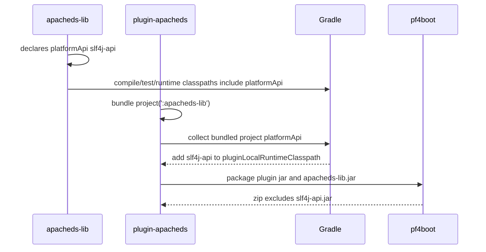

# `platformApi` Propagation Across Library Projects Design

[中文](platform-api-propagation-design-zh.md) | [English](platform-api-propagation-design-en.md)

> The Chinese document is the primary source. This English document is a synchronized copy. This design guides the next implementation step for platform dependency boundaries when non-plugin library projects are packaged by plugins.

## 1. Background

Real pf4boot plugin projects often package one or more business library projects:

```text
root
├─ plugin-apacheds
└─ apacheds-lib
```

`apacheds-lib` may use `org.slf4j.Logger` and `org.slf4j.LoggerFactory`. These APIs are provided by the host platform and should not be packaged again into the plugin ZIP, otherwise host/plugin class loading boundaries may conflict.

However, `apacheds-lib` still needs those APIs for compilation, tests, and local main / JavaExec runs. Plugin local runtime also needs them to avoid:

```text
NoClassDefFoundError: org/slf4j/LoggerFactory
```

So `platformApi` must have a unified cross-library contract:

```text
compile-visible + test-visible + local-runtime-visible + plugin-local-runtime-visible + not packaged
```

## 2. Goals

1. Non-plugin library projects can apply `net.xdob.pf4boot` and declare `platformApi`.
2. Library `platformApi` is visible to `compileJava`.
3. Library `platformApi` is visible to `compileTestJava` and `testRuntimeClasspath`.
4. Library `platformApi` is visible to local JavaExec / main runs.
5. When a plugin declares `bundle project(':some-lib')`, that library jar is packaged into the plugin ZIP.
6. That library's `platformApi` dependencies are added to plugin `pluginLocalRuntimeClasspath`.
7. That library's `platformApi` dependencies are not added to plugin ZIP `lib/`.
8. Diagnostics should be able to explain the platform boundary, with source reporting improved in later phases.

## 3. Non-goals

1. Do not import platform dependencies from an `app-run` project that packages plugins.
2. Do not require host projects to expose runtimeClasspath to plugin projects.
3. Do not package `platformApi` into plugin ZIPs.
4. Do not automatically mutate all `JavaExec` tasks.
5. Do not change existing `bundle` / `bundleOnly` / `embed` packaging semantics.
6. Do not implement full classloader simulation or host runtime resolution.
7. Do not hard-block projects named `app-run`; the plugin cannot reliably infer project responsibilities and should document the risk instead.

## 4. Current State

### 4.1 `net.xdob.pf4boot`

The base plugin provides:

```java
public static final String PLATFORM_API_CONFIG_NAME = "platformApi";
public static final String PLATFORM_CLASSPATH_CONFIG_NAME = "platformClasspath";
```

Current core relationships:

```text
platformClasspath extendsFrom platformApi
compileClasspath extendsFrom platformApi
```

Needed relationships:

```text
runtimeClasspath extendsFrom platformApi
testCompileClasspath extendsFrom platformApi
testRuntimeClasspath extendsFrom platformApi
```

### 4.2 `net.xdob.pf4boot-plugin`

Plugin projects already have:

```text
pluginLocalRuntimeClasspath extendsFrom platformClasspath
```

Needed:

```text
pluginLocalRuntimeClasspath += bundled library projects' platformApi dependencies
```

Only local runtime classpath changes. These dependencies must not be added to `bundle` / `bundleOnly` / `embed`, and ZIP copy specs must remain unchanged.

## 5. Constraints

| Constraint | Requirement |
| --- | --- |
| Gradle | Stay compatible with Gradle 7. |
| JDK | Production code remains JDK 8 syntax. |
| Packaging | Keep `platformApi` out of plugin ZIPs. |
| Cycles | Plugins do not depend back on `app-run`. |
| Explicitness | Library projects must explicitly apply `net.xdob.pf4boot` and declare `platformApi`. |
| Testing | Must have Gradle TestKit multi-project functional tests. |

## 6. API Design

### 6.1 Library project

```groovy
plugins {
  id 'java-library'
  id 'net.xdob.pf4boot'
}

dependencies {
  platformApi "org.slf4j:slf4j-api:${slf4j_version}"
}
```

### 6.2 Plugin project

```groovy
plugins {
  id 'net.xdob.pf4boot-plugin'
}

dependencies {
  bundle project(':apacheds-lib')
}
```

### 6.3 Local run

```groovy
tasks.register('runPluginLocal', JavaExec) {
  classpath = sourceSets.main.runtimeClasspath + configurations.pluginLocalRuntimeClasspath
  mainClass = 'com.example.PluginLocalMain'
}
```

## 7. Implementation Design

### 7.1 `Pf4boot`

In `Pf4boot.apply(Project)`, get:

```java
Configuration runtimeClasspath =
    project.getConfigurations().getByName(JavaPlugin.RUNTIME_CLASSPATH_CONFIGURATION_NAME);
Configuration testCompileClasspath =
    project.getConfigurations().getByName(JavaPlugin.TEST_COMPILE_CLASSPATH_CONFIGURATION_NAME);
Configuration testRuntimeClasspath =
    project.getConfigurations().getByName(JavaPlugin.TEST_RUNTIME_CLASSPATH_CONFIGURATION_NAME);
```

Then wire:

```java
runtimeClasspath.extendsFrom(platformApi);
testCompileClasspath.extendsFrom(platformApi);
testRuntimeClasspath.extendsFrom(platformApi);
```

Keep:

```java
compileClasspath.extendsFrom(platformApi);
platformClasspath.extendsFrom(platformApi);
```

### 7.2 `Pf4bootPlugin`

In plugin projects, scan `ProjectDependency` declarations from `bundle` / `bundleOnly` / `embed`.

For each packaged project:

1. If it has `platformApi`, copy its declared dependencies to the plugin project's `pluginLocalRuntimeClasspath`.
2. If its runtimeClasspath contains project dependencies, collect those library projects' `platformApi` according to the dependency group semantics.
3. Copy dependency declarations only, not project output jars.
4. Do not change ZIP copy specs.

Group recursion rules:

| Group | Recursively collect `platformApi` from project dependencies? | Reason |
| --- | --- | --- |
| `bundle` | Yes | `bundle` has transitive packaging semantics; local runtime should also have transitive platform APIs. |
| `embed` | Yes | Current `embed` behavior is close to transitive packaging while keeping a separate source marker. |
| `bundleOnly` | No, collect only directly declared project dependencies' `platformApi` | Preserve `bundleOnly` non-transitive semantics. |

Pseudo-code:

```java
Set<Project> bundledProjects = collectBundledProjects(bundle, bundleOnly, embed);
for (Project bundledProject : bundledProjects) {
  Configuration platformApi = bundledProject.getConfigurations().findByName("platformApi");
  if (platformApi != null) {
    for (Dependency dependency : platformApi.getDependencies()) {
      pluginLocalRuntimeClasspath.getDependencies().add(dependency.copy());
    }
  }
}
```

### 7.3 Why copy dependencies instead of cross-project `extendsFrom`

Avoid:

```java
pluginLocalRuntimeClasspath.extendsFrom(bundledProjectPlatformApi)
```

Reasons:

1. Cross-project `extendsFrom` is harder to reason about.
2. Target project configuration lifecycle is more complex.
3. Copying dependencies keeps plugin local runtime classpath explicit.

Later source reporting can be improved in `DependencyReporter`.

### 7.4 Local runtime semantics for `platformApi project(...)`

When a library declares:

```groovy
dependencies {
  platformApi project(':platform-api')
}
```

`platform-api.jar` should be present in the declaring library project's compile, test, and local runtime classpaths, and in the plugin project's `pluginLocalRuntimeClasspath` when the plugin packages that library.

But `platform-api.jar` must not be added to the plugin ZIP.

Reason: if `platform-api` contains API classes or interfaces, local runs must be able to load them. They are still provided by the host platform and must not become plugin-private packaged dependencies.

### 7.5 Key guardrail: runtimeClasspath must not pollute plugin ZIPs

`Pf4boot` will make library `runtimeClasspath` see `platformApi`. Functional tests must prove that:

```groovy
dependencies {
  bundle project(':apacheds-lib')
}
```

does not cause `apacheds-lib` `platformApi` dependencies to be resolved into plugin `bundle` and packaged into the ZIP.

If tests show that `platformApi` pollutes plugin ZIPs, implementation must fall back to a more conservative approach:

1. Do not make library `runtimeClasspath.extendsFrom(platformApi)`.
2. Add a dedicated local runtime configuration for library projects.
3. Use that local runtime configuration for tests and local runs.

The hard acceptance remains: ZIP must not contain `slf4j-api.jar`.

## 8. Sequence



## 9. Error Handling

| Scenario | Behavior |
| --- | --- |
| Packaged project does not apply `net.xdob.pf4boot` | Do not collect `platformApi`; keep compatibility. |
| Packaged project `platformApi` fails resolution | Local runtime or diagnostics fail with dependency coordinates. |
| Platform dependency is also in `bundle` | Existing duplicate diagnostics warn/fail. |
| Recursive project dependency cycle | Use a visited set to avoid infinite recursion. |
| `bundleOnly` indirect dependency misses platform API | Preserve non-transitive semantics and suggest using `bundle` or explicit platform API declaration. |

## 10. Idempotency

- Reconfiguration must not duplicate platform dependencies.
- Use `Set<Project>` when collecting projects recursively.
- Do not generate extra files.
- Do not mutate user `JavaExec` tasks.

## 11. Rollback

- If plugin local runtime classpath becomes problematic, users can temporarily remove library `platformApi` or declare it explicitly in the plugin project.
- If recursive collection causes issues, fall back to direct packaged project collection only.
- Since ZIP contents do not include `platformApi`, rollback does not alter published ZIP structure.

## 12. Compatibility

| Area | Notes |
| --- | --- |
| Existing plugin projects | No behavior change if they do not use library `platformApi`. |
| Existing library projects | No behavior change if they do not apply `net.xdob.pf4boot`. |
| ZIP content | Must not add platform API jars. |
| Gradle | Use Gradle 7 APIs. |
| JDK | Use JDK 8 syntax. |

Version target: this includes base plugin classpath semantic changes, plugin-side platform dependency collection, and new multi-project behavior. It should target `1.7.0`, not a patch release.

## 13. Test Plan

Add Gradle TestKit functional test:

```java
shouldKeepBundledLibraryPlatformApiVisibleForLibraryAndPluginLocalRuntimeButNotPackaged()
```

Test project shape:

```text
root
├─ slf4j-api
├─ apacheds-lib
└─ plugin-demo
```

Assertions:

1. `apacheds-lib:compileJava` succeeds.
2. `apacheds-lib:compileTestJava` succeeds.
3. `apacheds-lib:runtimeClasspath` contains `slf4j-api-*.jar`.
4. `apacheds-lib:testRuntimeClasspath` contains `slf4j-api-*.jar`.
5. `plugin-demo:pluginLocalRuntimeClasspath` contains `slf4j-api-*.jar`.
6. `plugin-demo` ZIP contains `apacheds-lib-*.jar`.
7. `plugin-demo` ZIP does not contain `slf4j-api-*.jar`.
8. `bundleOnly project(':apacheds-lib')` collects only direct `apacheds-lib` `platformApi`, not transitive runtime project dependency `platformApi`.
9. `platformApi project(':platform-api')` makes `platform-api.jar` visible locally but keeps it out of the plugin ZIP.

Verification commands:

```powershell
.\gradlew.bat functionalTest
.\gradlew.bat check
```

## 14. Risks

| Risk | Impact | Mitigation |
| --- | --- | --- |
| Platform dependencies enter ordinary runtimeClasspath | Library local runtime classpath grows. | This matches the local-runtime-visible goal and does not affect ZIP packaging. |
| Platform dependency version conflict | Local runtime may differ from host runtime. | Later improve source and conflict reporting in `pf4bootDependencies`. |
| Indirect library collection misses dependencies | Plugin local run may still miss APIs. | Recursively scan runtime project dependencies and cover with tests. |
| Diagnostic source is not precise enough | Users may not know which library contributed the API. | Later add source project metadata to `ResolvedArtifactInfo`. |
| Advanced Gradle metadata is not fully copied | Capabilities / rich versions may not behave fully. | First version explicitly supports ordinary dependency declarations only. |

## 15. Phased Implementation Plan

| Phase | Scope | Acceptance |
| --- | --- | --- |
| Phase 1 | Wire `platformApi` into runtime/test classpaths in `Pf4boot`. | Library compile/test/runtime can see platform APIs. |
| Phase 2 | Collect packaged library `platformApi` into plugin `pluginLocalRuntimeClasspath`, with recursive `bundle` / `embed` and non-recursive `bundleOnly`. | Plugin local runtime can see packaged library platform APIs without breaking `bundleOnly`. |
| Phase 3 | Add functional tests for three-project, non-recursive `bundleOnly`, and `platformApi project(...)` scenarios. | `functionalTest` / `check` pass and ZIP excludes platform API jars. |
| Phase 4 | Update usage/developer/troubleshooting/changelog. | Bilingual docs explain not to import from `app-run`. |
| Phase 5 | Improve diagnostic source display (optional). | `pf4bootDependencies` can explain whether platform APIs come from the current plugin or packaged libraries. |
