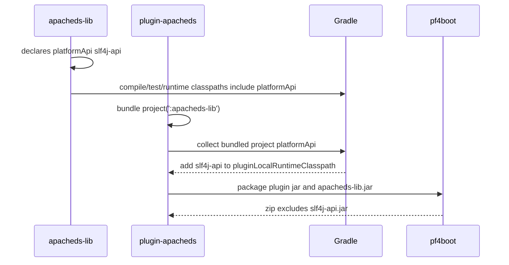

# `platformApi` 跨库项目传递设计文档

[中文](platform-api-propagation-design-zh.md) | [English](platform-api-propagation-design-en.md)

> 中文文档为主文档，英文文档为同步副本。本文档用于指导下一版本实现，重点解决非插件库项目声明 `platformApi` 后，被插件打包依赖时的平台依赖边界问题。

## 1. 背景

在真实 pf4boot 插件工程中，插件项目通常会打包一个或多个业务库项目。例如：

```text
root
├─ plugin-apacheds
└─ apacheds-lib
```

`apacheds-lib` 可能直接使用 `org.slf4j.Logger`、`org.slf4j.LoggerFactory`。这些 API 由宿主平台提供，不应被插件 zip 再携带一份，否则可能造成宿主和插件之间的日志 API 类加载冲突。

但 `apacheds-lib` 自己的编译、测试、本地 main / JavaExec 又需要这些 API 可见。插件本地运行时也需要它们可见，否则会出现：

```text
NoClassDefFoundError: org/slf4j/LoggerFactory
```

因此需要把 `platformApi` 定义为跨库项目也成立的统一语义：

```text
编译可见 + 测试可见 + 本地运行可见 + 插件本地运行可见 + 不打包
```

## 2. 目标

1. 非插件库项目应用 `net.xdob.pf4boot` 后，可以声明 `platformApi`。
2. 非插件库项目的 `platformApi` 对该库 `compileJava` 可见。
3. 非插件库项目的 `platformApi` 对该库 `compileTestJava` 和 `testRuntimeClasspath` 可见。
4. 非插件库项目的 `platformApi` 对该库本地 JavaExec / main 运行可见。
5. 插件项目通过 `bundle project(':some-lib')` 打包该库时，库 jar 进入插件 zip。
6. 被打包库项目的 `platformApi` 进入插件项目 `pluginLocalRuntimeClasspath`。
7. 被打包库项目的 `platformApi` 不进入插件 zip 的 `lib/`。
8. 诊断和报告能解释平台依赖边界，后续可继续增强来源展示。

## 3. 非目标

1. 不从包含插件包的 `app-run` 反向导入平台依赖。
2. 不要求宿主项目暴露 runtimeClasspath 给插件项目。
3. 不把 `platformApi` 打进插件 zip。
4. 不自动修改所有 `JavaExec`。
5. 不改变 `bundle` / `bundleOnly` / `embed` 的既有打包语义。
6. 不实现完整的 classloader 模拟或宿主运行时解析。
7. 不硬性禁止用户依赖名为 `app-run` 的项目；插件无法可靠判断项目职责，只在文档中给出风险提示。

## 4. 现状

### 4.1 `net.xdob.pf4boot`

当前基础插件提供：

```java
public static final String PLATFORM_API_CONFIG_NAME = "platformApi";
public static final String PLATFORM_CLASSPATH_CONFIG_NAME = "platformClasspath";
```

现有核心关系：

```text
platformClasspath extendsFrom platformApi
compileClasspath extendsFrom platformApi
```

需要补齐：

```text
runtimeClasspath extendsFrom platformApi
testCompileClasspath extendsFrom platformApi
testRuntimeClasspath extendsFrom platformApi
```

### 4.2 `net.xdob.pf4boot-plugin`

当前插件项目已有：

```text
pluginLocalRuntimeClasspath extendsFrom platformClasspath
```

需要补齐：

```text
pluginLocalRuntimeClasspath += bundled library projects' platformApi dependencies
```

注意：只把依赖加入插件本地运行 classpath，不把它们加入 `bundle` / `bundleOnly` / `embed`，也不让 zip 复制这些平台依赖。

## 5. 核心约束

| 约束 | 要求 |
| --- | --- |
| Gradle | 保持 Gradle 7 兼容。 |
| JDK | 生产代码保持 JDK 8 语法。 |
| 默认打包 | 不改变 `platformApi` 不打包的边界。 |
| 循环依赖 | 插件不反向依赖 `app-run`。 |
| 显式性 | 需要库项目显式应用 `net.xdob.pf4boot` 并声明 `platformApi`。 |
| 测试 | 必须有 Gradle TestKit 多项目功能测试。 |

## 6. 接口设计

### 6.1 库项目声明

```groovy
plugins {
  id 'java-library'
  id 'net.xdob.pf4boot'
}

dependencies {
  platformApi "org.slf4j:slf4j-api:${slf4j_version}"
}
```

### 6.2 插件项目声明

```groovy
plugins {
  id 'net.xdob.pf4boot-plugin'
}

dependencies {
  bundle project(':apacheds-lib')
}
```

### 6.3 本地运行

```groovy
tasks.register('runPluginLocal', JavaExec) {
  classpath = sourceSets.main.runtimeClasspath + configurations.pluginLocalRuntimeClasspath
  mainClass = 'com.example.PluginLocalMain'
}
```

## 7. 实现设计

### 7.1 `Pf4boot` 修改

在 `Pf4boot.apply(Project)` 中获取：

```java
Configuration runtimeClasspath =
    project.getConfigurations().getByName(JavaPlugin.RUNTIME_CLASSPATH_CONFIGURATION_NAME);
Configuration testCompileClasspath =
    project.getConfigurations().getByName(JavaPlugin.TEST_COMPILE_CLASSPATH_CONFIGURATION_NAME);
Configuration testRuntimeClasspath =
    project.getConfigurations().getByName(JavaPlugin.TEST_RUNTIME_CLASSPATH_CONFIGURATION_NAME);
```

并建立关系：

```java
runtimeClasspath.extendsFrom(platformApi);
testCompileClasspath.extendsFrom(platformApi);
testRuntimeClasspath.extendsFrom(platformApi);
```

保留：

```java
compileClasspath.extendsFrom(platformApi);
platformClasspath.extendsFrom(platformApi);
```

### 7.2 `Pf4bootPlugin` 修改

在插件项目中扫描 `bundle` / `bundleOnly` / `embed` 中声明的 `ProjectDependency`。

对每个被打包的项目：

1. 如果该项目存在 `platformApi`，复制其 declared dependencies 到插件项目的 `pluginLocalRuntimeClasspath`。
2. 如果该项目 runtimeClasspath 中还包含 project dependency，按分组语义决定是否递归收集这些库项目的 `platformApi`。
3. 只复制依赖声明，不复制项目输出 jar。
4. 不改变 zip copy spec。

分组递归规则：

| 分组 | 是否递归收集 project dependency 的 `platformApi` | 原因 |
| --- | --- | --- |
| `bundle` | 是 | `bundle` 是传递打包语义，本地运行也应具备传递平台 API。 |
| `embed` | 是 | 当前 `embed` 行为接近传递打包，保留独立来源标记。 |
| `bundleOnly` | 否，只收集直接 project dependency 的 `platformApi` | 保持 `bundleOnly` 非传递语义。 |

伪代码：

```java
Set<Project> bundledProjects = collectBundledProjects(bundle, bundleOnly, embed);
for (Project bundledProject : bundledProjects) {
  Configuration platformApi = bundledProject.getConfigurations().findByName("platformApi");
  if (platformApi != null) {
    for (Dependency dependency : platformApi.getDependencies()) {
      pluginLocalRuntimeClasspath.getDependencies().add(dependency.copy());
    }
  }
}
```

### 7.3 为什么复制 dependency 而不是直接 extendsFrom

不建议：

```java
pluginLocalRuntimeClasspath.extendsFrom(bundledProjectPlatformApi)
```

原因：

1. 跨项目直接 extendsFrom 可读性差，后续诊断来源更难解释。
2. 被依赖项目配置生命周期更复杂。
3. 复制 dependency 可以保持插件项目本地运行配置是明确的依赖集合。

后续如果需要更精确来源，可在 `DependencyReporter` 中增加 source metadata。

### 7.4 `platformApi project(...)` 本地运行语义

当库项目声明：

```groovy
dependencies {
  platformApi project(':platform-api')
}
```

`platform-api.jar` 应进入声明方库项目的编译、测试、本地运行 classpath，也应进入打包该库的插件项目的 `pluginLocalRuntimeClasspath`。

但 `platform-api.jar` 不应进入插件 zip。

原因：如果 `platform-api` 项目中包含接口或 API 类，本地运行必须能加载这些 class；同时这些 class 仍由宿主平台提供，不能作为插件私有依赖打包。

### 7.5 关键风险防线：runtimeClasspath 不得污染插件 zip

`Pf4boot` 会让库项目的 `runtimeClasspath` 对 `platformApi` 可见。必须通过功能测试确认：

```groovy
dependencies {
  bundle project(':apacheds-lib')
}
```

不会导致 `apacheds-lib` 的 `platformApi` 被 Gradle runtime variant 解析进插件 `bundle` 并最终进入 zip。

如果测试发现 `platformApi` 会污染插件 zip，则实现必须回退为更保守方案：

1. 不让库项目 `runtimeClasspath.extendsFrom(platformApi)`。
2. 为库项目新增独立 local runtime configuration。
3. 测试和本地运行使用该 local runtime configuration。

当前设计以功能测试结果为准：zip 不包含 `slf4j-api.jar` 是硬性验收。

## 8. 时序流程



## 9. 异常处理

| 场景 | 行为 |
| --- | --- |
| 被打包项目未应用 `net.xdob.pf4boot` | 不收集 `platformApi`，保持兼容。 |
| 被打包项目 `platformApi` 解析失败 | 在插件本地运行或诊断解析时失败，错误指向依赖坐标。 |
| 平台依赖被错误放入 `bundle` | 继续由重复依赖诊断 warning/fail。 |
| 递归项目依赖成环 | 使用 visited set 避免无限递归。 |
| `bundleOnly` 间接依赖缺少平台 API | 保持非传递语义，只提示用户改用 `bundle` 或显式声明平台 API。 |

## 10. 幂等性

- 多次配置不应重复添加相同平台依赖导致解析结果重复。
- 递归收集项目时使用 `Set<Project>` 去重。
- 不生成额外文件。
- 不修改用户已有 `JavaExec` 任务。

## 11. 回滚策略

- 若插件本地运行 classpath 引入异常，可临时移除库项目的 `platformApi` 或改为插件项目显式声明。
- 若递归收集造成问题，可退回为仅收集直接 `bundle project(...)` 的库项目。
- 因为 zip 打包内容不包含 `platformApi`，回滚不会影响已发布插件包结构。

## 12. 兼容性

| 项 | 说明 |
| --- | --- |
| 旧插件项目 | 未使用库项目 `platformApi` 时行为不变。 |
| 旧库项目 | 未应用 `net.xdob.pf4boot` 时行为不变。 |
| zip 内容 | 不应新增平台 API jar。 |
| Gradle | 使用 Gradle 7 API。 |
| JDK | 使用 JDK 8 语法。 |

版本定位：该需求包含基础插件 classpath 语义变化、插件项目平台依赖收集和新的多项目行为，建议作为 `1.7.0` 目标，而不是 patch 版本。

## 13. 测试方案

新增 Gradle TestKit 功能测试：

```java
shouldKeepBundledLibraryPlatformApiVisibleForLibraryAndPluginLocalRuntimeButNotPackaged()
```

测试项目结构：

```text
root
├─ slf4j-api
├─ apacheds-lib
└─ plugin-demo
```

验收断言：

1. `apacheds-lib:compileJava` 成功。
2. `apacheds-lib:compileTestJava` 成功。
3. `apacheds-lib:runtimeClasspath` 输出包含 `slf4j-api-*.jar`。
4. `apacheds-lib:testRuntimeClasspath` 输出包含 `slf4j-api-*.jar`。
5. `plugin-demo:pluginLocalRuntimeClasspath` 输出包含 `slf4j-api-*.jar`。
6. `plugin-demo` zip 包含 `apacheds-lib-*.jar`。
7. `plugin-demo` zip 不包含 `slf4j-api-*.jar`。
8. `bundleOnly project(':apacheds-lib')` 只收集 `apacheds-lib` 直接 `platformApi`，不递归收集其 runtime project dependency 的 `platformApi`。
9. `platformApi project(':platform-api')` 时，`platform-api.jar` 本地运行可见，但不进入插件 zip。

验证命令：

```powershell
.\gradlew.bat functionalTest
.\gradlew.bat check
```

## 14. 风险点

| 风险 | 影响 | 缓解 |
| --- | --- | --- |
| 平台依赖进入普通 runtimeClasspath | 库项目本地运行 classpath 变大。 | 该行为符合 `platformApi` 本地运行可见目标，并且不影响 zip。 |
| 被打包库项目平台依赖版本冲突 | 本地运行可能使用与宿主不同版本。 | 后续增强 `pf4bootDependencies` 来源和冲突报告。 |
| 递归收集遗漏间接库 | 插件本地运行仍缺依赖。 | 递归扫描 runtimeClasspath 中的 `ProjectDependency`，并用测试覆盖。 |
| 诊断来源不够细 | 用户难以定位依赖来自哪个库。 | 后续在 `ResolvedArtifactInfo` 增加来源项目字段。 |
| 高级 Gradle metadata 未完整复制 | capability / rich version 等场景行为不完整。 | 第一版明确只支持常规依赖声明，高级场景后续增强。 |

## 15. 分阶段实施计划

| 阶段 | 范围 | 验收 |
| --- | --- | --- |
| 阶段 1 | `Pf4boot` 中补齐 runtime/test classpath 继承 `platformApi`。 | 库项目 compile/test/runtime 可见平台 API。 |
| 阶段 2 | `Pf4bootPlugin` 收集被打包库项目 `platformApi` 到 `pluginLocalRuntimeClasspath`，并区分 `bundle` / `embed` 递归、`bundleOnly` 非递归。 | 插件本地运行 classpath 可见库项目平台 API，且不破坏 `bundleOnly` 语义。 |
| 阶段 3 | 功能测试覆盖三项目、`bundleOnly` 非递归、`platformApi project(...)` 场景。 | `functionalTest` / `check` 通过，zip 不含平台 API jar。 |
| 阶段 4 | 更新 usage/developer/troubleshooting/changelog。 | 中英文文档同步，说明不从 `app-run` 反向导入。 |
| 阶段 5 | 增强诊断来源展示（可选）。 | `pf4bootDependencies` 能说明平台 API 来自当前插件或被打包库项目。 |
