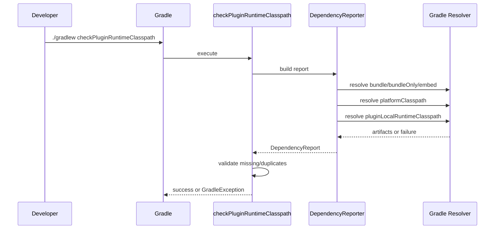

# pf4boot-plugin Platform Runtime Dependency and Release Reliability Design

[中文](platform-runtime-design-zh.md) | [English](platform-runtime-design-en.md)

> The Chinese document is the primary source. This English document is a synchronized copy for collaboration and review.

## 1. Background

`pf4boot-plugin` focuses on local development convenience for pf4boot plugin projects. It currently supports:

- Generating plugin metadata from `plugin.properties` or the `pf4bootPlugin` extension.
- Generating plugin ZIP artifacts via the `pf4boot` task.
- Controlling plugin package dependencies with `bundle` / `bundleOnly` / `embed`.
- Declaring host-provided API dependencies with `platformApi`.
- Publishing plugin ZIP artifacts through `pf4bootElements`.

Polarix exposed a typical issue: the host platform declares `slf4j-api` through `platformApi`, so plugin execution inside the host usually works. However, when a bundled project or library is executed directly through IDE, Gradle `JavaExec`, or diagnostic tasks, that module's own `runtimeClasspath` may not contain `slf4j-api`, causing:

```text
NoClassDefFoundError: org/slf4j/LoggerFactory
```

The temporary project-side fix is:

```gradle
runtimeOnly("org.slf4j:slf4j-api:${slf4j_version}")
```

This makes a single module self-contained for local execution, but it does not provide a unified dependency boundary for pf4boot plugin development: packaged by plugin, provided by host platform, visible for local run, and explainable by diagnostics.

The `1.4.0` release also showed that release validation was not strong enough: real projects may have no `plugin.properties` file and only use the `pf4bootPlugin` extension. This scenario must be covered by regression tests and release readiness checks.

## 2. Goals

1. Add a local runtime classpath where `platformApi` is visible to IDE, `JavaExec`, and diagnostic tasks.
2. Keep plugin ZIP packaging compatible; do not package `platformApi` dependencies by default.
3. Provide runtime dependency diagnostics that classify packaged, platform-provided, local-runtime-visible, duplicate, and missing dependencies.
4. Cover `bundle project(":xxx")` and trace bundled project runtime dependencies.
5. Add release readiness checks to avoid inconsistencies between version, changelog, documentation examples, tags, and artifacts.
6. Add troubleshooting documentation for `NoClassDefFoundError`, `plugin.properties`, `unspecified`, and Windows UTF-8 issues.

## 3. Non-Goals

- Do not remove the existing `platformApi` semantics.
- Do not package platform APIs by default.
- Do not introduce concrete logging implementations such as `logback` or `slf4j-simple`.
- Do not implement full bytecode constant-pool scanning in the first phase.
- Do not require existing business modules to rewrite dependency declarations.
- Do not wire new diagnostic tasks into `check` by default.
- Do not introduce Gradle 8-only APIs.

## 4. Current Code Facts

### 4.1 `Pf4boot`

File: [Pf4boot.java](../src/main/java/net/xdob/pf4boot/Pf4boot.java)

Existing constants:

```java
public static final String PLUGIN_CONFIG_NAME = "plugin";
public static final String PLUGIN_CLASSPATH_CONFIG_NAME = "pluginClasspath";
public static final String PLATFORM_API_CONFIG_NAME = "platformApi";
public static final String PLATFORM_CLASSPATH_CONFIG_NAME = "platformClasspath";
```

Existing behavior:

- `platformApi`: not resolvable, not consumable; declares platform APIs.
- `platformClasspath`: resolvable, not consumable; `extendsFrom(platformApi)`.
- `compileClasspath.extendsFrom(platformApi)`.
- `pluginClasspath`: resolvable, used for plugin ZIP consumption.

Conclusion: `platformApi` is visible at compile time and can be resolved through `platformClasspath`, but it does not automatically enter the standard `runtimeClasspath`.

Important clarification: if `platformApi` declares a normal module dependency, for example `platformApi("org.slf4j:slf4j-api:2.0.7")`, `platformClasspath` can resolve a jar. If it declares a BOM, `platform(project(":platform-bom"))`, or pure constraints, it only provides version constraints and does not provide a runtime jar. Local runtime visibility requires a resolvable artifact dependency.

### 4.2 `Pf4bootPlugin`

File: [Pf4bootPlugin.java](../src/main/java/net/xdob/pf4boot/Pf4bootPlugin.java)

Existing constants:

```java
public static final String BUNDLE_CONFIG_NAME = "bundle";
public static final String BUNDLE_ONLY_CONFIG_NAME = "bundleOnly";
public static final String EMBED_CONFIG_NAME = "embed";
public static final String PF4BOOT_ELEMENTS_CONFIG_NAME = "pf4bootElements";
```

Existing behavior:

- `bundle`: resolvable, not consumable, transitive, packaged into the ZIP.
- `bundleOnly`: resolvable, not consumable, non-transitive, packaged into the ZIP.
- `embed`: resolvable, not consumable, transitive, packaged into the ZIP.
- The plugin project's `compileClasspath` and `runtimeClasspath` extend from `bundle`, `bundleOnly`, and `embed`.
- The `pf4boot` task copies the project jar, `bundle`, `bundleOnly`, and `embed` files into ZIP `lib/`.
- `pf4bootElements` exposes the ZIP artifact.

`bundle project(":xxx")` variant selection needs attention. To consistently select the Java runtime variant, a future implementation may add the `Usage.JAVA_RUNTIME` attribute to `bundle`, `bundleOnly`, and `embed`; because this may affect existing resolution behavior, it must be covered by compatibility tests.

## 5. Constraints

| Constraint | Requirement |
| --- | --- |
| Gradle | Support Gradle 7.x; tests must cover the repository's current Gradle version. |
| JDK | Production code must remain JDK 8 compatible. |
| Default behavior | Do not change existing ZIP content or normal runtime dependency scope by default. |
| Platform boundary | `platformApi` means host-provided or locally simulated APIs, not plugin package dependencies. |
| Local run | The new classpath is for IDE, `JavaExec`, and diagnostics. |
| Logging implementation | Ensure APIs such as `slf4j-api` are visible; do not bind concrete implementations. |
| Tests | New behavior must have Gradle TestKit functional tests. |
| Encoding | Java compilation and Markdown files must remain UTF-8. |

## 6. Overall Design

The new capabilities are grouped into four areas:

| Capability | Name | Default impact |
| --- | --- | --- |
| Local runtime dependency configuration | `pluginLocalRuntimeClasspath` | Does not change ZIP or standard `runtimeClasspath`. |
| Full local run classpath | `sourceSets.main.runtimeClasspath + pluginLocalRuntimeClasspath` | Used by `JavaExec` / IDE and includes current project outputs. |
| Packaged dependency report | Resolve `bundle` / `bundleOnly` / `embed` separately | Avoid breaking `bundleOnly` non-transitive semantics with a merged configuration. |
| Dependency diagnostics | `checkPluginRuntimeClasspath` / `pf4bootDependencies` | Manual tasks; not wired into `check` by default. |
| Release checks | `verifyReleaseReadiness` / `verifyReleaseTag` | Separate pre-release checks from post-tag verification. |

Recommended implementation order:

1. Configurations.
2. Local run classpath convention.
3. Dependency classification helper.
4. `pf4bootDependencies` reporting task.
5. `checkPluginRuntimeClasspath` validation task.
6. `verifyReleaseReadiness` task.
7. `verifyReleaseTag` task.
8. Documentation and troubleshooting.

## 7. Interface Design

### 7.1 New Constants

Add to `Pf4bootPlugin`:

```java
public static final String PLUGIN_LOCAL_RUNTIME_CLASSPATH_CONFIG_NAME = "pluginLocalRuntimeClasspath";
public static final String PF4BOOT_DEPENDENCIES_TASK_NAME = "pf4bootDependencies";
public static final String CHECK_PLUGIN_RUNTIME_CLASSPATH_TASK_NAME = "checkPluginRuntimeClasspath";
public static final String VERIFY_RELEASE_READINESS_TASK_NAME = "verifyReleaseReadiness";
public static final String VERIFY_RELEASE_TAG_TASK_NAME = "verifyReleaseTag";
public static final String PF4BOOT_INFO_TASK_NAME = "pf4bootInfo";
```

### 7.2 `pluginLocalRuntimeClasspath`

Purpose: provide extra dependencies needed by local runs and diagnostics, especially `platformClasspath`.

Important constraints:

- `pluginLocalRuntimeClasspath` is a dependency configuration, not the complete Java runtime classpath.
- The complete local run classpath must be `sourceSets.main.runtimeClasspath + configurations.pluginLocalRuntimeClasspath`.
- Do not pass only `pluginLocalRuntimeClasspath` to `JavaExec.classpath`; otherwise current project `classes` and `resources` may be missing.

Requirements:

- `canBeResolved=true`
- `canBeConsumed=false`
- `visible=false`
- `transitive=true`
- Extends from `platformClasspath`

Suggested implementation:

```java
Configuration platformClasspath =
    project.getConfigurations().getByName(Pf4boot.PLATFORM_CLASSPATH_CONFIG_NAME);

Configuration pluginLocalRuntimeClasspath =
    project.getConfigurations().create(PLUGIN_LOCAL_RUNTIME_CLASSPATH_CONFIG_NAME, conf -> {
        conf.setCanBeConsumed(false);
        conf.setCanBeResolved(true);
        conf.setTransitive(true);
        conf.setVisible(false);
        conf.setDescription("Local runtime classpath for pf4boot plugin development and diagnostics.");
    });

pluginLocalRuntimeClasspath.extendsFrom(platformClasspath);
```

Important rules:

- Do not make `runtimeClasspath.extendsFrom(platformClasspath)`.
- Do not copy dependencies from `platformClasspath` into the `pf4boot` ZIP.
- The plugin project's runtime, classes, and resources come from `sourceSets.main.runtimeClasspath`.
- Local JavaExec examples must use:

```gradle
tasks.register("runPluginDiagnostic", JavaExec) {
  classpath = sourceSets.main.runtimeClasspath + configurations.pluginLocalRuntimeClasspath
  mainClass = "your.diagnostic.Main"
}
```

### 7.3 Packaged Dependency Classification

Purpose: represent dependencies actually packaged into the ZIP for reports and diagnostics.

Design constraints:

- Do not add a merged `pluginPackagedClasspath` configuration.
- Diagnostic and reporting tasks must resolve `bundle`, `bundleOnly`, and `embed` separately.
- This preserves the `bundleOnly` `transitive=false` semantics and avoids accidentally pulling transitive dependencies through a merged configuration.

Suggested classification:

```text
packaged.bundle = bundle.files
packaged.bundleOnly = bundleOnly.files
packaged.embed = embed.files
packaged.projectJar = jar task archive file
```

Important rules:

- `bundle` and `embed` resolve transitively.
- `bundleOnly` resolves only directly declared dependencies.
- Reports may merge the resolved results for display, but resolution must not first merge the configurations.
- If a merged view is needed later, build it from resolved results, not through `extendsFrom(bundle, bundleOnly, embed)`.

### 7.4 `pf4bootDependencies`

Task type: phase 1 may use `DefaultTask`; later it can become a dedicated task class.

Responsibilities:

- Resolve `bundle`, `bundleOnly`, and `embed` separately.
- Resolve `platformClasspath`.
- Resolve `pluginLocalRuntimeClasspath`.
- Print grouped report.
- Print duplicate dependency warnings.
- Do not fail except for configuration resolution failures.

Suggested output:

```text
pf4boot dependency report

Plugin:
  jar: <project-name>-<version>.jar
  zip: build/libs/<project-name>-<version>.zip

Packaged dependencies:
  - group:name:version

Platform dependencies:
  - group:name:version

Local runtime dependencies:
  - group:name:version

Duplicated between packaged and platform:
  - group:name
```

Acceptance:

- The report must distinguish `bundle`, `bundleOnly`, `embed`, platform, and local runtime dependencies.
- Coordinates must be sorted by `group:name` or `group:name:version` for stable output.

### 7.5 `checkPluginRuntimeClasspath`

Responsibilities:

- Reuse the same classification logic as `pf4bootDependencies`.
- Fail when any relevant configuration fails to resolve.
- Warn on `bundle` / `bundleOnly` / `embed` and platform duplicates by default.
- Phase 1 does not infer bytecode-level missing dependencies; it only verifies that already declared platform APIs are available in the local run classpath.
- Detecting dependencies that were excluded but are still required at runtime must be implemented in phase 2 through bytecode scanning or explicit rules.

Phase 1 rules:

| Rule | Failure condition |
| --- | --- |
| `pluginLocalRuntimeClasspath` resolves | Resolution failure. |
| `platformClasspath` resolves | Resolution failure. |
| `bundle` / `bundleOnly` / `embed` resolve | Any resolution failure. |
| Platform dependencies are visible in local runtime dependency configuration | A platform module is not present in `pluginLocalRuntimeClasspath`. |

Error example:

```text
Missing platform runtime dependency in pluginLocalRuntimeClasspath:
- org.slf4j:slf4j-api:2.0.7

Suggested fixes:
- keep platformApi("org.slf4j:slf4j-api:<version>") in the platform/plugin project
- use sourceSets.main.runtimeClasspath + configurations.pluginLocalRuntimeClasspath for JavaExec/IDE local runs
- or declare runtimeOnly("org.slf4j:slf4j-api:<version>") in the standalone runnable library
```

Phase 2 rules:

- Scan class constant pools from packaged/local runtime jars.
- Report the jar/class that references a missing class.
- Start with a small built-in mapping such as `org/slf4j/LoggerFactory -> org.slf4j:slf4j-api`.

### 7.6 `verifyReleaseReadiness`

Responsibilities:

- Read-only release preparation check.
- Do not modify versions.
- Do not create tags.
- Do not publish artifacts.

Rules:

| Check | Failure condition |
| --- | --- |
| Version | `gradle.properties` `version` is empty or contains `SNAPSHOT`. |
| Changelog | `CHANGELOG.md` or `CHANGELOG_EN.md` does not contain `## [<version>]`. |
| README | README examples do not contain the current version. |
| Usage | usage examples do not contain the current version. |
| ZIP | After `pf4boot`, ZIP is missing, lacks `plugin.properties`, or lacks `lib/`. |

Suggested dependency:

```text
verifyReleaseReadiness dependsOn pf4boot
```

### 7.7 `verifyReleaseTag`

Purpose: verify release tag placement after the tag is created. It is not a blocking pre-release readiness check.

Rules:

| Check | Failure condition |
| --- | --- |
| Tag exists | `v<version>` does not exist. |
| Tag target | `v<version>` does not point to current `HEAD`. |
| Tag on HEAD | Current `HEAD` does not have the matching version tag. |

Suggested command order:

```powershell
.\gradlew.bat verifyReleaseReadiness
git tag v<version> -m "Release <version>"
.\gradlew.bat verifyReleaseTag
```

### 7.8 `pf4bootInfo`

Responsibilities:

- Print effective plugin metadata.
- Print metadata source.
- Print ZIP path.
- Print packaged/platform/local runtime dependency counts.

Rules:

- Do not perform validation failures except metadata resolution failures.
- Keep output stable and concise.

## 8. Implementation Breakdown

### 8.1 Recommended New Classes

| Class | Package | Responsibility |
| --- | --- | --- |
| `ResolvedArtifactInfo` | `net.xdob.pf4boot` | Resolved dependency coordinates and source. |
| `DependencyReport` | `net.xdob.pf4boot` | Holds packaged/platform/local/duplicate classifications. |
| `DependencyReporter` | `net.xdob.pf4boot` | Builds `DependencyReport` from Gradle configurations. |
| `Pf4bootDependenciesTask` | `net.xdob.pf4boot` | Prints dependency report. |
| `CheckPluginRuntimeClasspathTask` | `net.xdob.pf4boot` | Validates runtime classpath diagnostics. |
| `VerifyReleaseReadinessTask` | `net.xdob.pf4boot` | Performs release readiness checks. |
| `Pf4bootInfoTask` | `net.xdob.pf4boot` | Prints plugin metadata and summary. |

For a smaller first phase, tasks may be registered with `project.getTasks().register(..., task -> task.doLast(...))`, but implementation should avoid putting all logic directly inside `Pf4bootPlugin.apply`.

### 8.2 `ResolvedArtifactInfo`

Suggested fields:

```java
final class ResolvedArtifactInfo {
    private final String group;
    private final String name;
    private final String version;
    private final String classifier;
    private final String extension;
    private final File file;
    private final String source;
}
```

Suggested methods:

```java
String moduleKey();       // group:name
String coordinate();      // group:name:version
String displayName();     // group:name:version -> file name
```

JDK 8 rule: do not use `record`.

### 8.3 `DependencyReporter`

Inputs:

- `Configuration bundle`
- `Configuration bundleOnly`
- `Configuration embed`
- `Configuration platformClasspath`
- `Configuration pluginLocalRuntimeClasspath`

Output:

- `DependencyReport`

Implementation rules:

- Read artifacts with `configuration.getResolvedConfiguration().getResolvedArtifacts()`.
- On resolution failure, throw `GradleException` including the configuration name.
- Use `TreeMap` / `TreeSet` to keep output stable.
- Detect duplicates by `group:name`, not full version coordinates.

### 8.4 Bundled Project Tracing

Phase 1 must ensure:

- `bundle project(":apacheds-lib")` resolves through the `bundle` configuration.
- `apacheds-lib` runtime dependencies are visible in local runtime diagnostics.

If Gradle resolution cannot provide a clean path in phase 1, report:

```text
Source: packaged configuration bundle
```

Phase 2 can improve this to:

```text
Source: bundled project :apacheds-lib runtimeClasspath
```

## 9. Data Structures

### 9.1 Dependency Source Constants

Phase 1 may use string constants:

```java
private static final String SOURCE_PACKAGED = "packaged";
private static final String SOURCE_PLATFORM = "platform";
private static final String SOURCE_LOCAL_RUNTIME = "localRuntime";
```

These can later become an enum.

### 9.2 Diagnostic Result

```java
final class DependencyReport {
    private final Set<ResolvedArtifactInfo> packagedArtifacts;
    private final Set<ResolvedArtifactInfo> platformArtifacts;
    private final Set<ResolvedArtifactInfo> localRuntimeArtifacts;
    private final Set<String> duplicateModuleKeys;
    private final Set<ResolvedArtifactInfo> missingPlatformArtifactsInLocalRuntime;
}
```

## 10. State Machine

| State | Trigger | Result |
| --- | --- | --- |
| `READY` | Task starts. | Prepare configuration resolution. |
| `RESOLUTION_FAILED` | Any configuration fails to resolve. | Task fails. |
| `REPORT_READY` | All classpaths resolve successfully. | Build report. |
| `DUPLICATE_FOUND` | Same `group:name` exists in packaged and platform. | Print warning. |
| `MISSING_FOUND` | Platform module missing from local runtime. | `checkPluginRuntimeClasspath` fails. |
| `COMPLETED` | No blocking issue. | Task succeeds. |

## 11. Sequence



## 12. Error Handling

| Error | Behavior |
| --- | --- |
| Dependency resolution failure | Throw `GradleException("Failed to resolve <configuration>: <message>")`. |
| Platform dependency not in local runtime | `checkPluginRuntimeClasspath` fails with missing coordinates and suggestions. |
| Packaged/platform duplicate | Phase 1 warning; later configurable as failure. |
| ZIP artifact missing files | `verifyReleaseReadiness` fails with ZIP path and missing entry. |
| Tag missing or shifted | `verifyReleaseTag` fails with expected tag and HEAD. |

## 13. Idempotency

- Diagnostic and report tasks are read-only by default.
- `verifyReleaseReadiness` does not create tags, modify versions, or publish.
- `pf4bootDependencies` does not generate extra files.
- `checkPluginRuntimeClasspath` does not mutate configurations.
- `pluginLocalRuntimeClasspath` only adds a resolvable configuration and does not change existing `runtimeClasspath`.

## 14. Rollback Strategy

- New tasks are not wired into `check` by default.
- If `pluginLocalRuntimeClasspath` is problematic, users can avoid referencing it.
- If diagnostics are noisy, downgrade checks to warnings.
- If release checks disrupt workflow, keep them manual and outside the release plugin lifecycle.

## 15. Compatibility

| Area | Strategy |
| --- | --- |
| Existing projects | Do not change ZIP content or `runtimeClasspath`. |
| Gradle 7 | Use Gradle 7-compatible APIs. |
| JDK 8 | Avoid `record`, `var`, and newer Stream APIs. |
| Windows | Keep `JavaCompile` UTF-8; tests must not depend on system default encoding. |
| Docs | Chinese is primary; English is a synchronized copy; both link to each other. |

## 16. Test Plan

### 16.1 Suggested Functional Tests

File: [Pf4bootPluginFunctionalTest.java](../src/functionalTest/java/net/xdob/pf4boot/Pf4bootPluginFunctionalTest.java)

Suggested test names:

```java
shouldExposePlatformApiInPluginLocalRuntimeClasspath()
shouldNotPackagePlatformApiByDefault()
shouldReportPackagedPlatformAndLocalRuntimeDependencies()
shouldFailRuntimeClasspathCheckWhenPlatformDependencyNotInLocalRuntime()
shouldVerifyReleaseReadinessForCurrentVersion()
```

### 16.2 Test Project Shape

Use a TestKit temporary multi-project build:

```text
settings.gradle
build.gradle
plugin-a/build.gradle
plugin-a/plugin.properties
apacheds-lib/build.gradle
apacheds-lib/src/main/java/...
```

`plugin-a` example:

```gradle
plugins {
  id('java')
  id('net.xdob.pf4boot-plugin')
}

repositories {
  mavenCentral()
}

dependencies {
  platformApi "org.slf4j:slf4j-api:2.0.7"
  bundle project(":apacheds-lib")
}
```

`apacheds-lib` example:

```gradle
plugins {
  id('java-library')
}

repositories {
  mavenCentral()
}

dependencies {
  implementation("org.apache.mina:mina-core:2.2.3") {
    exclude group: "org.slf4j"
  }
}
```

If tests cannot access the network, prefer local fixture jars to avoid external dependency resolution.

### 16.3 Acceptance Commands

```powershell
.\gradlew.bat functionalTest
.\gradlew.bat check
```

After release readiness is implemented:

```powershell
.\gradlew.bat verifyReleaseReadiness
```

### 16.4 Required Regression Tests

- No `plugin.properties`, only `pf4bootPlugin` extension.
- Changing `plugin.properties` regenerates metadata.
- Chinese `plugin.properties` stays UTF-8.
- Windows `JavaCompile` uses UTF-8.
- Gradle 7 does not fail `Zip` configuration because an optional input file is missing.

## 17. Documentation Plan

Add or update:

| Document | Chinese | English |
| --- | --- | --- |
| Platform runtime design | `docs/platform-runtime-design-zh.md` | `docs/platform-runtime-design-en.md` |
| Platform runtime implementation plan | `docs/platform-runtime-implementation-plan-zh.md` | `docs/platform-runtime-implementation-plan-en.md` |
| Usage | `docs/usage-zh.md` | `docs/usage-en.md` |
| Developer guide | `docs/developer-guide-zh.md` | `docs/developer-guide-en.md` |
| Improvement plan | `docs/improvement-plan-zh.md` | `docs/improvement-plan-en.md` |
| Troubleshooting | `docs/troubleshooting-zh.md` | `docs/troubleshooting-en.md` |

All paired docs should start with:

```markdown
[中文](xxx-zh.md) | [English](xxx-en.md)
```

README:

```markdown
[中文](README.md) | [English](README_EN.md)
```

CHANGELOG:

```markdown
[中文](CHANGELOG.md) | [English](CHANGELOG_EN.md)
```

## 18. Phased Implementation Plan

The phased implementation plan has been split into dedicated tracking documents so the design and execution plan do not drift.

- [平台运行时依赖实施计划（中文）](platform-runtime-implementation-plan-zh.md)
- [Platform Runtime Dependency Implementation Plan (English)](platform-runtime-implementation-plan-en.md)

## 19. Risks

| Risk | Impact | Mitigation |
| --- | --- | --- |
| Local runtime differs from host runtime | Local works but host fails. | Clearly separate packaged, platform, and localRuntime in reports. |
| Diagnostic false positives | Developers stop trusting the tool. | Phase 1 uses Gradle resolution facts only. |
| ZIP changes by default | Dependency surface expands after upgrade. | Do not package platform APIs by default. |
| Release tag shifts | Published version misses fixes. | `verifyReleaseTag` checks tag and HEAD. |
| Network-dependent tests are flaky | CI instability. | Prefer local fixtures for functional tests. |

## 20. Open Questions

1. Should `embed` be clearly separated from `bundle`, or remain a reserved future strategy group?
2. Should `checkPluginRuntimeClasspath` eventually be wired into `check`?
3. Should duplicate dependencies warn or fail by default?
4. Should all `JavaExec` tasks be adapted automatically, or should users explicitly use `pluginLocalRuntimeClasspath`?
5. Should platform APIs be imported from a host project, not only declared in the current project?

## 21. 1.6.0 Design Addendum: Strengthen the `platformApi` Contract

### 21.1 Background

The host or root project often already brings in `org.slf4j:slf4j-api`. If a plugin project adds the same dependency through `implementation`, `bundle`, or `embed`, the logging API can be packaged into the plugin ZIP and may conflict with the host/plugin class loading boundary.

At the same time, plugin source code and local standalone `main` runs still need `org.slf4j.Logger` and `org.slf4j.LoggerFactory` to be visible. Therefore, the 1.6.0 priority is not to import platform dependencies from `app-run`, but to define the `platformApi` contract as:

```text
compile-visible + local-runtime-visible + not packaged
```

### 21.2 Decisions

| Question | Decision |
| --- | --- |
| Should plugin projects depend on `app-run`? | Not recommended. `app-run` usually consumes plugin ZIPs, so reverse dependency from plugins can create build cycles. |
| Is `platformApi` compile-visible? | Yes. Plugin source should be able to import platform API types directly. |
| Is `platformApi` local-runtime-visible? | Yes. It is exposed through `pluginLocalRuntimeClasspath` for local `JavaExec` / IDE runs. |
| Is `platformApi` packaged? | No. It is not added to pf4boot ZIP `lib/` by default. |
| Should host project import be automatic? | No automatic import. If needed later, import only from explicit `platform-api` / `platform-deps` projects. |
| `platformApi` in non-plugin library projects | It follows the same three-part contract and is propagated to plugin local runtime when the library is packaged, but not into the plugin ZIP. |

### 21.3 Recommended Usage

```groovy
dependencies {
  platformApi "org.slf4j:slf4j-api:${slf4j_version}"
}

tasks.register('runPluginLocal', JavaExec) {
  classpath = sourceSets.main.runtimeClasspath + configurations.pluginLocalRuntimeClasspath
  mainClass = 'com.example.PluginLocalMain'
}
```

### 21.4 Acceptance

- API types declared through `platformApi` compile with `compileJava`.
- `platformApi` in non-plugin library projects compiles with `compileJava` / `compileTestJava` and is present in that library's `runtimeClasspath` / `testRuntimeClasspath`.
- `platformApi` dependencies resolve in `pluginLocalRuntimeClasspath`.
- When a plugin declares `bundle project(":some-lib")`, `some-lib` platform APIs are available in the plugin `pluginLocalRuntimeClasspath`.
- `platformApi` dependencies do not appear in pf4boot ZIP `lib/`.
- Docs clearly warn against reverse dependency on an `app-run` project that packages plugins.
- Functional tests cover project dependency style platform APIs, not only external module coordinates.

### 21.5 Non-plugin Library Example

```groovy
// apacheds-lib/build.gradle
plugins {
  id 'java-library'
  id 'net.xdob.pf4boot'
}

dependencies {
  platformApi "org.slf4j:slf4j-api:${slf4j_version}"
}
```

```groovy
// plugin-apacheds/build.gradle
plugins {
  id 'net.xdob.pf4boot-plugin'
}

dependencies {
  bundle project(':apacheds-lib')
}
```

Expected behavior:

- `apacheds-lib` can compile, test, and run local JavaExec tasks with `slf4j-api`.
- `plugin-apacheds` local runtime classpath can see `slf4j-api`.
- `plugin-apacheds` ZIP contains `apacheds-lib.jar`, but not `slf4j-api.jar`.
