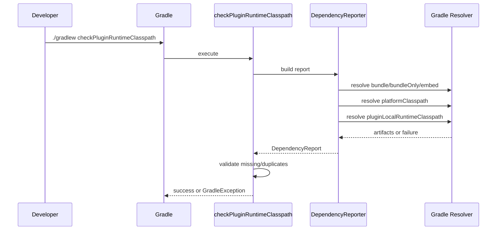

# pf4boot-plugin 平台运行时依赖与发布可靠性设计文档

[中文](platform-runtime-design-zh.md) | [English](platform-runtime-design-en.md)

> 中文文档为主文档，英文文档为同步副本。实现时以中文文档为准，英文文档用于协作和对照。

## 1. 背景

`pf4boot-plugin` 面向 pf4boot 插件开发，核心价值是让插件项目在本地更容易打包、验证和排查依赖问题。当前已经支持：

- `plugin.properties` 或 `pf4bootPlugin` 扩展生成插件元数据。
- `pf4boot` 任务生成插件 zip。
- `bundle` / `bundleOnly` / `embed` 控制插件包依赖。
- `platformApi` 声明宿主平台可提供的 API 依赖。
- `pf4bootElements` 暴露插件 zip 给其他模块消费。

Polarix 中遇到的问题是：宿主平台通过 `platformApi` 提供 `slf4j-api`，插件由宿主启动时通常正常；但 bundled project 或业务库通过 IDE、Gradle `JavaExec`、诊断任务单独运行时，模块自身 `runtimeClasspath` 不一定包含 `slf4j-api`，从而出现：

```text
NoClassDefFoundError: org/slf4j/LoggerFactory
```

临时修复是在具体业务库中增加：

```gradle
runtimeOnly("org.slf4j:slf4j-api:${slf4j_version}")
```

该修复能让单模块运行自洽，但不能统一解决 pf4boot 插件开发中“平台提供、插件携带、本地运行可见、诊断可解释”的边界问题。

同时，`1.4.0` 发布暴露了发布前验证不足：真实场景中 `plugin.properties` 完全不存在、只使用 `pf4bootPlugin` 扩展配置时，发布版本无法工作。后续必须把真实用户场景、发布一致性和 tag 位置检查纳入设计。

## 2. 目标

1. 新增本地运行 runtime classpath，使 `platformApi` 在 IDE、`JavaExec`、诊断任务中可见。
2. 保持插件 zip 打包语义兼容，默认不把 `platformApi` 依赖打入 zip。
3. 提供插件运行时依赖诊断，明确“插件包携带”“宿主平台提供”“本地运行可见”“重复”“缺失”。
4. 覆盖 `bundle project(":xxx")`，能够追踪 bundled project 的 runtime 依赖。
5. 建立发布前自动检查，避免版本、changelog、文档示例、tag 和产物内容不一致。
6. 沉淀 troubleshooting 文档，降低 `NoClassDefFoundError`、`plugin.properties`、`unspecified`、Windows UTF-8 等问题的定位成本。

## 3. 非目标

- 不取消现有 `platformApi` 语义。
- 不默认把平台 API 打入插件 zip。
- 不引入具体日志实现，例如 `logback`、`slf4j-simple`。
- 第一阶段不做完整字节码常量池扫描。
- 不要求修改业务模块现有依赖声明。
- 新增诊断任务默认不接入 `check`，除非用户显式启用。
- 不引入 Gradle 8 专属 API。

## 4. 当前代码事实

### 4.1 `Pf4boot`

文件：[Pf4boot.java](../src/main/java/net/xdob/pf4boot/Pf4boot.java)

现有常量：

```java
public static final String PLUGIN_CONFIG_NAME = "plugin";
public static final String PLUGIN_CLASSPATH_CONFIG_NAME = "pluginClasspath";
public static final String PLATFORM_API_CONFIG_NAME = "platformApi";
public static final String PLATFORM_CLASSPATH_CONFIG_NAME = "platformClasspath";
```

现有行为：

- `platformApi`：不可解析、不可消费，表示平台 API 声明。
- `platformClasspath`：可解析、不可消费，`extendsFrom(platformApi)`。
- `compileClasspath.extendsFrom(platformApi)`。
- `pluginClasspath`：可解析，面向插件 zip 消费。

结论：`platformApi` 目前对编译可见，也能通过 `platformClasspath` 解析，但不会自动进入普通 `runtimeClasspath`。

需要明确：如果 `platformApi` 声明的是普通 module 依赖，例如 `platformApi("org.slf4j:slf4j-api:2.0.7")`，`platformClasspath` 可以解析出 jar；如果声明的是 BOM、`platform(project(":platform-bom"))` 或纯 constraints，它只能提供版本约束，不能提供本地运行所需 jar。需要本地运行可见时，必须存在可解析 artifact 依赖。

### 4.2 `Pf4bootPlugin`

文件：[Pf4bootPlugin.java](../src/main/java/net/xdob/pf4boot/Pf4bootPlugin.java)

现有常量：

```java
public static final String BUNDLE_CONFIG_NAME = "bundle";
public static final String BUNDLE_ONLY_CONFIG_NAME = "bundleOnly";
public static final String EMBED_CONFIG_NAME = "embed";
public static final String PF4BOOT_ELEMENTS_CONFIG_NAME = "pf4bootElements";
```

现有行为：

- `bundle`：可解析、不可消费、传递依赖，打入 zip。
- `bundleOnly`：可解析、不可消费、非传递依赖，打入 zip。
- `embed`：可解析、不可消费、传递依赖，打入 zip。
- 插件项目 `compileClasspath` 和 `runtimeClasspath` 会继承 `bundle`、`bundleOnly`、`embed`。
- `pf4boot` 任务把插件 jar、`bundle`、`bundleOnly`、`embed` 放入 zip 的 `lib/`。
- `pf4bootElements` 暴露 zip artifact。

`bundle project(":xxx")` 的 variant 选择需要特别关注。为了稳定拿到 Java runtime 变体，后续可考虑给 `bundle`、`bundleOnly`、`embed` 增加 `Usage.JAVA_RUNTIME` attribute；该变化可能影响现有解析结果，必须放入兼容性测试。

## 5. 核心约束

| 约束 | 要求 |
| --- | --- |
| Gradle | 支持 Gradle 7.x，测试至少覆盖当前仓库使用版本。 |
| JDK | 生产代码保持 JDK 8 语法。 |
| 默认行为 | 不改变现有 zip 内容，不默认扩大运行时依赖面。 |
| 平台边界 | `platformApi` 表示宿主提供或本地模拟提供，不等于插件包依赖。 |
| 本地运行 | 新增 classpath 可用于 IDE、`JavaExec`、诊断任务。 |
| 日志实现 | 只保障 `slf4j-api` 等 API 可见，不绑定实现。 |
| 测试 | 新增行为必须有 Gradle TestKit 功能测试。 |
| 编码 | Java 编译和 Markdown 保持 UTF-8。 |

## 6. 总体方案

新增能力分为四组：

| 能力 | 名称 | 默认影响 |
| --- | --- | --- |
| 本地运行依赖配置 | `pluginLocalRuntimeClasspath` | 不改变 zip，不改变普通 `runtimeClasspath`。 |
| 本地运行完整 classpath | `sourceSets.main.runtimeClasspath + pluginLocalRuntimeClasspath` | 给 `JavaExec` / IDE 使用，包含当前项目输出。 |
| 插件打包依赖报告 | 分别解析 `bundle` / `bundleOnly` / `embed` | 避免合并配置破坏 `bundleOnly` 非传递语义。 |
| 依赖诊断任务 | `checkPluginRuntimeClasspath` / `pf4bootDependencies` | 手动执行，默认不接入 `check`。 |
| 发布检查任务 | `verifyReleaseReadiness` / `verifyReleaseTag` | 发布前检查和打 tag 后检查分离。 |

推荐实现顺序：

1. configuration。
2. 本地运行 classpath 约定。
3. 依赖分类工具类。
4. `pf4bootDependencies` 报告任务。
5. `checkPluginRuntimeClasspath` 校验任务。
6. `verifyReleaseReadiness` 发布检查任务。
7. `verifyReleaseTag` 标签检查任务。
8. 文档和 troubleshooting。

## 7. 接口设计

### 7.1 新增常量

在 `Pf4bootPlugin` 中新增：

```java
public static final String PLUGIN_LOCAL_RUNTIME_CLASSPATH_CONFIG_NAME = "pluginLocalRuntimeClasspath";
public static final String PF4BOOT_DEPENDENCIES_TASK_NAME = "pf4bootDependencies";
public static final String CHECK_PLUGIN_RUNTIME_CLASSPATH_TASK_NAME = "checkPluginRuntimeClasspath";
public static final String VERIFY_RELEASE_READINESS_TASK_NAME = "verifyReleaseReadiness";
public static final String VERIFY_RELEASE_TAG_TASK_NAME = "verifyReleaseTag";
public static final String PF4BOOT_INFO_TASK_NAME = "pf4bootInfo";
```

### 7.2 `pluginLocalRuntimeClasspath`

用途：提供本地运行和诊断所需的额外依赖，尤其是 `platformClasspath`。

重要约束：

- `pluginLocalRuntimeClasspath` 是依赖 configuration，不等同于完整 Java 运行 classpath。
- 完整本地运行 classpath 必须使用 `sourceSets.main.runtimeClasspath + configurations.pluginLocalRuntimeClasspath`。
- 不能只把 `pluginLocalRuntimeClasspath` 直接传给 `JavaExec.classpath`，否则可能缺少当前项目的 `classes` 和 `resources` 输出。

配置要求：

- `canBeResolved=true`
- `canBeConsumed=false`
- `visible=false`
- `transitive=true`
- 继承 `platformClasspath`

建议实现：

```java
Configuration platformClasspath =
    project.getConfigurations().getByName(Pf4boot.PLATFORM_CLASSPATH_CONFIG_NAME);

Configuration pluginLocalRuntimeClasspath =
    project.getConfigurations().create(PLUGIN_LOCAL_RUNTIME_CLASSPATH_CONFIG_NAME, conf -> {
        conf.setCanBeConsumed(false);
        conf.setCanBeResolved(true);
        conf.setTransitive(true);
        conf.setVisible(false);
        conf.setDescription("Local runtime classpath for pf4boot plugin development and diagnostics.");
    });

pluginLocalRuntimeClasspath.extendsFrom(platformClasspath);
```

注意：

- 不要让 `runtimeClasspath.extendsFrom(platformClasspath)`。
- 不要让 `pf4boot` zip 从 `platformClasspath` 复制依赖。
- 插件项目自身 runtime、classes、resources 来自 `sourceSets.main.runtimeClasspath`。
- 本地 JavaExec 示例必须这样写：

```gradle
tasks.register("runPluginDiagnostic", JavaExec) {
  classpath = sourceSets.main.runtimeClasspath + configurations.pluginLocalRuntimeClasspath
  mainClass = "your.diagnostic.Main"
}
```

### 7.3 插件打包依赖分类

用途：表达 zip 实际携带的依赖集合，用于报告和诊断。

设计约束：

- 不新增合并后的 `pluginPackagedClasspath` configuration。
- 诊断和报告任务必须分别解析 `bundle`、`bundleOnly`、`embed`。
- 这样可以保留 `bundleOnly` 的 `transitive=false` 语义，避免合并配置后意外拉入传递依赖。

建议分类：

```text
packaged.bundle = bundle.files
packaged.bundleOnly = bundleOnly.files
packaged.embed = embed.files
packaged.projectJar = jar task archive file
```

注意：

- `bundle` 和 `embed` 按传递依赖解析。
- `bundleOnly` 只解析直接声明依赖。
- 报告层可以合并展示，但解析层不要先合并 configuration。
- 如后续确实需要合并后的视图，也应基于已解析结果合并，不应通过 `extendsFrom(bundle, bundleOnly, embed)` 生成新的可解析配置。

### 7.4 `pf4bootDependencies`

任务类型：第一阶段可使用普通 `DefaultTask` 内部实现；后续可抽象为独立任务类。

任务职责：

- 分别解析 `bundle`、`bundleOnly`、`embed`。
- 解析 `platformClasspath`。
- 解析 `pluginLocalRuntimeClasspath`。
- 输出分组报告。
- 输出重复依赖 warning。
- 不失败，除非 configuration 解析失败。

输出格式建议：

```text
pf4boot dependency report

Plugin:
  jar: <project-name>-<version>.jar
  zip: build/libs/<project-name>-<version>.zip

Packaged dependencies:
  - group:name:version

Platform dependencies:
  - group:name:version

Local runtime dependencies:
  - group:name:version

Duplicated between packaged and platform:
  - group:name
```

验收重点：

- 报告必须区分 `bundle`、`bundleOnly`、`embed`、platform、local runtime。
- 依赖坐标按 `group:name` 或 `group:name:version` 排序，保证输出稳定。

### 7.5 `checkPluginRuntimeClasspath`

任务职责：

- 复用 `pf4bootDependencies` 的分类逻辑。
- 任一相关 configuration 解析失败时任务失败。
- `bundle` / `bundleOnly` / `embed` 与 platform 重复时默认 warning。
- 第一阶段不做字节码推断，只验证“已声明的 platform API 是否能进入本地运行 classpath”。
- “被 exclude 但运行时仍需要”的缺失依赖诊断必须放到第二阶段字节码扫描或显式规则中实现。

第一阶段检查规则：

| 规则 | 失败条件 |
| --- | --- |
| `pluginLocalRuntimeClasspath` 可解析 | 解析失败则失败。 |
| `platformClasspath` 可解析 | 解析失败则失败。 |
| `bundle` / `bundleOnly` / `embed` 可解析 | 任一解析失败则失败。 |
| 平台依赖进入本地运行依赖配置 | `platformClasspath` 中的 module 不存在于 `pluginLocalRuntimeClasspath` 时失败。 |

错误信息示例：

```text
Missing platform runtime dependency in pluginLocalRuntimeClasspath:
- org.slf4j:slf4j-api:2.0.7

Suggested fixes:
- keep platformApi("org.slf4j:slf4j-api:<version>") in the platform/plugin project
- use sourceSets.main.runtimeClasspath + configurations.pluginLocalRuntimeClasspath for JavaExec/IDE local runs
- or declare runtimeOnly("org.slf4j:slf4j-api:<version>") in the standalone runnable library
```

第二阶段检查规则：

- 扫描 packaged/local runtime jar 中的 class 常量池。
- 发现缺失类后输出引用来源 jar/class。
- 典型类映射可先内置少量规则，例如 `org/slf4j/LoggerFactory -> org.slf4j:slf4j-api`。

### 7.6 `verifyReleaseReadiness`

任务职责：

- 发布前只读检查。
- 不修改版本。
- 不创建 tag。
- 不发布 artifact。

检查规则：

| 检查项 | 失败条件 |
| --- | --- |
| 版本 | `gradle.properties` 的 `version` 为空或包含 `SNAPSHOT`。 |
| changelog | `CHANGELOG.md` 和 `CHANGELOG_EN.md` 不包含 `## [<version>]`。 |
| README | README / README_EN 示例依赖不包含当前版本。 |
| Usage | usage-zh / usage-en 示例依赖不包含当前版本。 |
| zip | 执行或依赖 `pf4boot` 后，zip 不存在、缺 `plugin.properties`、缺 `lib/`。 |

建议任务依赖：

```text
verifyReleaseReadiness dependsOn pf4boot
```

### 7.7 `verifyReleaseTag`

用途：在 tag 创建后验证发布标签位置，不作为发布前 readiness 的阻塞项。

检查规则：

| 检查项 | 失败条件 |
| --- | --- |
| tag 存在 | 当前版本对应的 `v<version>` 不存在。 |
| tag 指向 | `v<version>` 不指向当前 `HEAD`。 |
| tag 唯一性 | 当前 `HEAD` 上没有对应版本 tag。 |

建议命令顺序：

```powershell
.\gradlew.bat verifyReleaseReadiness
git tag v<version> -m "Release <version>"
.\gradlew.bat verifyReleaseTag
```

### 7.8 `pf4bootInfo`

任务职责：

- 输出最终插件元数据。
- 输出元数据来源。
- 输出 zip 路径。
- 输出 packaged/platform/local runtime 依赖数量。

要求：

- 不做失败校验，除非元数据无法解析。
- 输出内容稳定、短小，适合作为本地排查第一步。

## 8. 实现拆分

### 8.1 推荐新增类

| 类 | 包 | 职责 |
| --- | --- | --- |
| `ResolvedArtifactInfo` | `net.xdob.pf4boot` | 表示解析后的依赖坐标和来源。 |
| `DependencyReport` | `net.xdob.pf4boot` | 保存 packaged/platform/local/duplicates 分类结果。 |
| `DependencyReporter` | `net.xdob.pf4boot` | 从 Gradle `Configuration` 生成 `DependencyReport`。 |
| `Pf4bootDependenciesTask` | `net.xdob.pf4boot` | 输出依赖报告。 |
| `CheckPluginRuntimeClasspathTask` | `net.xdob.pf4boot` | 执行运行时 classpath 诊断。 |
| `VerifyReleaseReadinessTask` | `net.xdob.pf4boot` | 执行发布前检查。 |
| `Pf4bootInfoTask` | `net.xdob.pf4boot` | 输出插件基础信息。 |

如果希望第一阶段更小，也可以先用 `project.getTasks().register(..., task -> task.doLast(...))` 实现，后续再抽任务类。但设计上应避免把所有逻辑堆在 `Pf4bootPlugin.apply` 中。

### 8.2 `ResolvedArtifactInfo`

字段建议：

```java
final class ResolvedArtifactInfo {
    private final String group;
    private final String name;
    private final String version;
    private final String classifier;
    private final String extension;
    private final File file;
    private final String source;
}
```

方法建议：

```java
String moduleKey();       // group:name
String coordinate();      // group:name:version
String displayName();     // group:name:version -> file name
```

JDK 8 要求：不要使用 `record`。

### 8.3 `DependencyReporter`

输入：

- `Configuration bundle`
- `Configuration bundleOnly`
- `Configuration embed`
- `Configuration platformClasspath`
- `Configuration pluginLocalRuntimeClasspath`

输出：

- `DependencyReport`

实现要求：

- 通过 `configuration.getResolvedConfiguration().getResolvedArtifacts()` 读取 artifact。
- 解析失败时抛 `GradleException`，信息中包含 configuration 名称。
- 输出集合使用 `TreeMap` / `TreeSet` 保持稳定顺序。
- 重复判断使用 `group:name`，不是完整版本坐标。

### 8.4 bundled project 追踪

第一阶段不强制输出完整 dependency path，但需要确保：

- `bundle project(":apacheds-lib")` 能通过 `bundle` 配置解析。
- `apacheds-lib` 的 runtime 依赖能进入本地运行诊断。

如果 Gradle resolution 无法直接给出清晰来源，第一阶段可在报告中标记为：

```text
Source: packaged configuration bundle
```

第二阶段再增强到：

```text
Source: bundled project :apacheds-lib runtimeClasspath
```

## 9. 数据结构

### 9.1 依赖来源枚举

第一阶段可以用字符串常量：

```java
private static final String SOURCE_PACKAGED = "packaged";
private static final String SOURCE_PLATFORM = "platform";
private static final String SOURCE_LOCAL_RUNTIME = "localRuntime";
```

后续可升级为 enum。

### 9.2 诊断结果

```java
final class DependencyReport {
    private final Set<ResolvedArtifactInfo> packagedArtifacts;
    private final Set<ResolvedArtifactInfo> platformArtifacts;
    private final Set<ResolvedArtifactInfo> localRuntimeArtifacts;
    private final Set<String> duplicateModuleKeys;
    private final Set<ResolvedArtifactInfo> missingPlatformArtifactsInLocalRuntime;
}
```

## 10. 状态机

| 状态 | 触发 | 结果 |
| --- | --- | --- |
| `READY` | 任务开始。 | 准备解析 configuration。 |
| `RESOLUTION_FAILED` | 任一 configuration 解析失败。 | 任务失败。 |
| `REPORT_READY` | 三类 classpath 均解析成功。 | 生成报告。 |
| `DUPLICATE_FOUND` | packaged 和 platform 存在同一 `group:name`。 | 输出 warning。 |
| `MISSING_FOUND` | platform module 未出现在 local runtime。 | `checkPluginRuntimeClasspath` 失败。 |
| `COMPLETED` | 无阻断问题。 | 任务成功。 |

## 11. 时序流程



## 12. 异常处理

| 异常 | 行为 |
| --- | --- |
| 依赖解析失败 | 抛 `GradleException("Failed to resolve <configuration>: <message>")`。 |
| 平台依赖没有进入本地运行 classpath | `checkPluginRuntimeClasspath` 失败，输出缺失坐标和建议。 |
| 插件包和平台重复 | 第一阶段 warning；后续可加扩展项切换为 fail。 |
| zip 产物缺文件 | `verifyReleaseReadiness` 失败，输出 zip 路径和缺失 entry。 |
| tag 缺失或偏移 | `verifyReleaseTag` 失败，输出期望 tag 和当前 HEAD。 |

## 13. 幂等性

- 所有诊断和报告任务默认只读。
- `verifyReleaseReadiness` 不创建 tag、不修改版本、不发布。
- `pf4bootDependencies` 不生成额外文件。
- `checkPluginRuntimeClasspath` 不修改 configuration。
- `pluginLocalRuntimeClasspath` 只新增可解析 configuration，不改变已有 `runtimeClasspath`。

## 14. 回滚策略

- 新增任务默认不接入 `check`，发现误报可以暂停使用。
- `pluginLocalRuntimeClasspath` 不影响打包，可通过不引用该 configuration 回避。
- 诊断逻辑如果误报，先降级为 warning。
- 发布检查如影响流程，保持手动执行，不接入 release 插件生命周期。

## 15. 兼容性

| 维度 | 策略 |
| --- | --- |
| 旧项目 | 不修改现有 zip 和 runtimeClasspath。 |
| Gradle 7 | 使用 Gradle 7 可用 API。 |
| JDK 8 | 不使用 `record`、`var`、Stream 新 API 等高版本语法。 |
| Windows | `JavaCompile` 保持 UTF-8；测试避免依赖系统默认编码。 |
| 文档 | 中文为主，英文为副本，头部互相链接。 |

## 16. 测试方案

### 16.1 新增功能测试建议

文件：[Pf4bootPluginFunctionalTest.java](../src/functionalTest/java/net/xdob/pf4boot/Pf4bootPluginFunctionalTest.java)

新增测试名：

```java
shouldExposePlatformApiInPluginLocalRuntimeClasspath()
shouldNotPackagePlatformApiByDefault()
shouldReportPackagedPlatformAndLocalRuntimeDependencies()
shouldFailRuntimeClasspathCheckWhenPlatformDependencyNotInLocalRuntime()
shouldVerifyReleaseReadinessForCurrentVersion()
```

### 16.2 测试项目结构

建议在 TestKit 临时目录中生成多模块项目：

```text
settings.gradle
build.gradle
plugin-a/build.gradle
plugin-a/plugin.properties
apacheds-lib/build.gradle
apacheds-lib/src/main/java/...
```

`plugin-a` 示例：

```gradle
plugins {
  id('java')
  id('net.xdob.pf4boot-plugin')
}

repositories {
  mavenCentral()
}

dependencies {
  platformApi "org.slf4j:slf4j-api:2.0.7"
  bundle project(":apacheds-lib")
}
```

`apacheds-lib` 示例：

```gradle
plugins {
  id('java-library')
}

repositories {
  mavenCentral()
}

dependencies {
  implementation("org.apache.mina:mina-core:2.2.3") {
    exclude group: "org.slf4j"
  }
}
```

注意：如果测试环境不能访问网络，应优先使用本地文件 jar 或已有测试 fixture 模拟依赖，避免功能测试依赖外网。

### 16.3 验收命令

```powershell
.\gradlew.bat functionalTest
.\gradlew.bat check
```

实现 release readiness 后新增：

```powershell
.\gradlew.bat verifyReleaseReadiness
```

### 16.4 必须保留的回归测试

- 不存在 `plugin.properties`，只使用 `pf4bootPlugin` 扩展。
- 修改 `plugin.properties` 后 `pf4boot` 能重新生成元数据。
- 中文 `plugin.properties` 保持 UTF-8。
- Windows 下 `JavaCompile` 使用 UTF-8。
- Gradle 7 下不存在的可选输入文件不会导致 `Zip` 任务配置失败。

## 17. 文档方案

新增或更新：

| 文档 | 中文 | 英文 |
| --- | --- | --- |
| 平台运行时设计 | `docs/platform-runtime-design-zh.md` | `docs/platform-runtime-design-en.md` |
| 平台运行时实施计划 | `docs/platform-runtime-implementation-plan-zh.md` | `docs/platform-runtime-implementation-plan-en.md` |
| 使用说明 | `docs/usage-zh.md` | `docs/usage-en.md` |
| 开发者手册 | `docs/developer-guide-zh.md` | `docs/developer-guide-en.md` |
| 改进规划 | `docs/improvement-plan-zh.md` | `docs/improvement-plan-en.md` |
| 故障排查 | `docs/troubleshooting-zh.md` | `docs/troubleshooting-en.md` |

所有成对文档头部都应加入：

```markdown
[中文](xxx-zh.md) | [English](xxx-en.md)
```

README 使用：

```markdown
[中文](README.md) | [English](README_EN.md)
```

CHANGELOG 使用：

```markdown
[中文](CHANGELOG.md) | [English](CHANGELOG_EN.md)
```

## 18. 分阶段实施计划

分阶段实施计划已拆分为独立追踪文档，避免设计说明和执行计划重复维护。

- [平台运行时依赖实施计划（中文）](platform-runtime-implementation-plan-zh.md)
- [Platform Runtime Dependency Implementation Plan (English)](platform-runtime-implementation-plan-en.md)

## 19. 风险点

| 风险 | 影响 | 缓解 |
| --- | --- | --- |
| 本地 runtime 与宿主 runtime 不一致 | 本地能跑但宿主失败。 | 报告明确区分 packaged、platform、localRuntime。 |
| 诊断误报 | 开发者不信任工具。 | 第一阶段只基于 Gradle 解析事实，避免字节码推断。 |
| 默认改变 zip | 升级后依赖面扩大。 | platform API 默认不打包。 |
| release tag 偏移 | 发布版本不含修复。 | `verifyReleaseTag` 检查 tag。 |
| 网络依赖测试不稳定 | CI 偶发失败。 | 功能测试优先使用本地 fixture。 |

## 20. 开放问题

1. `embed` 是否需要与 `bundle` 明确区分，还是保留为未来策略分组。
2. `checkPluginRuntimeClasspath` 是否最终接入 `check`。
3. 重复依赖默认 warning 还是 fail。
4. 是否自动适配所有 `JavaExec`，还是只提供 `pluginLocalRuntimeClasspath` 让用户显式引用。
5. platform API 是否需要支持从宿主项目导入，而不仅是当前项目声明。
